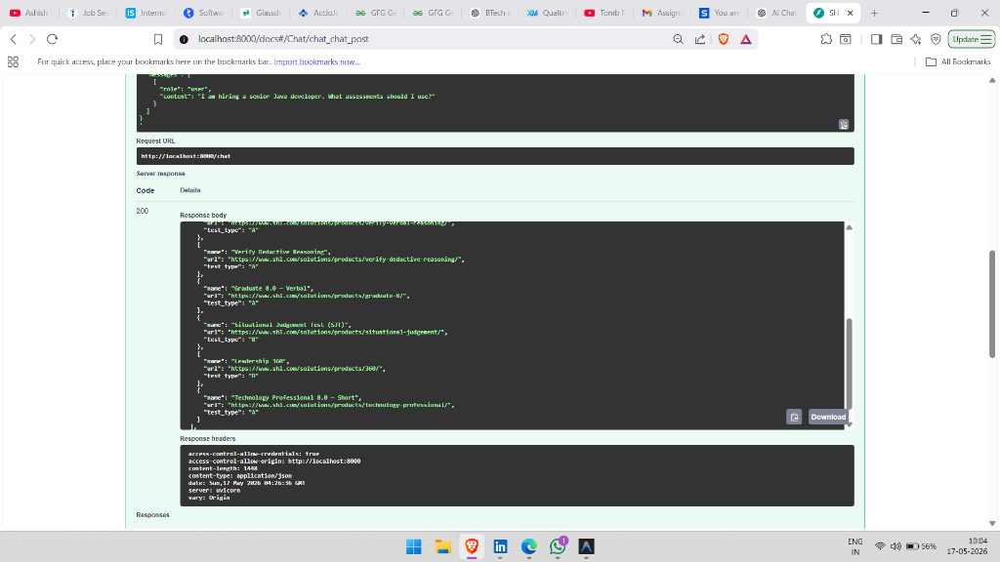
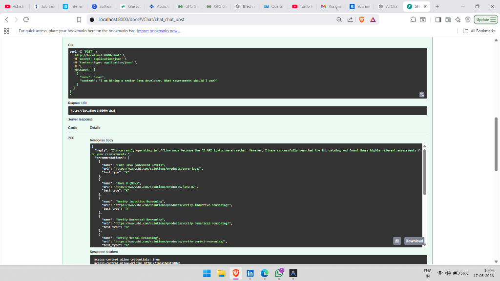

# SHL Assessment Recommender Agent




An enterprise-grade, conversational AI agent designed to recommend, compare, and refine SHL assessments. Built with FastAPI, FAISS, and Gemini/OpenRouter, this stateless application acts as an intelligent HR assistant to help recruiters select the right technical and behavioral assessments.

## 🚀 Key Engineering Features

This project was built with a "production-first" mindset, focusing heavily on reliability, security, and scalability.

*   **🛡️ Safety-First Validation & Guardrails:**
    *   **Prompt Injection Defense:** A fast regex pre-filter blocks jailbreak attempts (`"ignore previous instructions"`) before the LLM is even invoked.
    *   **Scope Enforcement:** Hardcoded rules immediately block queries related to legal advice, salary negotiation, coding assistance, or non-HR topics.
*   **🧠 Strict Hallucination Prevention:**
    *   **Catalog-Only Integrity:** Recommendations are filtered through an absolute firewall. If the LLM generates an assessment name that does not exist character-for-character in the official catalog, it is automatically dropped from the response.
*   **🌐 True Stateless Architecture:**
    *   **Infinite Scalability:** The `POST /chat` endpoint requires zero database or session storage. It accepts the full `messages` conversation history on every request, making the API trivial to scale horizontally.
    *   **Context Window Management:** The application automatically truncates conversation history to the last 8 turns to prevent token blowout while retaining semantic context.
*   **🔋 Smart Offline Fallback Mode:**
    *   **Fault Tolerance:** If third-party LLM APIs (Gemini/OpenRouter) fail due to network outages, 429 quota exhaustion, or invalid keys, the application **does not crash**. It gracefully intercepts the failure and returns a friendly offline message alongside highly accurate vector-search recommendations from the local FAISS database.

---

## 🛠️ Tech Stack
*   **Framework**: FastAPI (Python 3.11+)
*   **Vector Search**: FAISS + `sentence-transformers/all-MiniLM-L6-v2`
*   **LLM Integration**: `google-genai` SDK (Gemini 2.0 Flash) with OpenRouter fallback
*   **Scraping**: BeautifulSoup4 + Requests
*   **Validation**: Pydantic v2

---

## ⚙️ Setup & Installation

### 1. Clone & Install Dependencies
```bash
git clone <your-repo-url>
cd shl-recommender
python -m venv venv

# Windows
venv\Scripts\activate
# Mac/Linux
source venv/bin/activate

pip install -r requirements.txt
```

### 2. Configure Environment
Copy the example environment file and add your API keys:
```bash
cp .env.example .env
```
Open `.env` and add your **Gemini API Key** or **OpenRouter API Key**. 
*(Note: If no key is provided, the app will automatically run in Offline Fallback Mode).*

### 3. Initialize the Vector Database
Scrape the SHL catalog and build the FAISS index:
```bash
python scripts/scrape_catalog.py
python scripts/build_index.py
```

### 4. Run the API
```bash
uvicorn app.main:app --host 0.0.0.0 --port 8000 --reload
```
View the interactive Swagger documentation at: **http://localhost:8000/docs**

---

## 🧪 Running Tests
The project includes a robust `pytest` suite (33 tests) covering schema validation, guardrails, and end-to-end routing.
```bash
export PYTHONPATH="."  # Mac/Linux
$env:PYTHONPATH = "."  # Windows PowerShell
pytest tests/ -v
```

---

## ☁️ Deployment (Render / Railway)
This application is fully configured for PaaS deployment.
1. Connect your GitHub repository to Render or Railway.
2. The platform will automatically detect the `requirements.txt` and `Procfile`.
3. Set the following Environment Variables in the platform dashboard:
   * `GEMINI_API_KEY`
   * `APP_ENV=production`
4. Deploy! The application will bind to the `$PORT` environment variable automatically.
